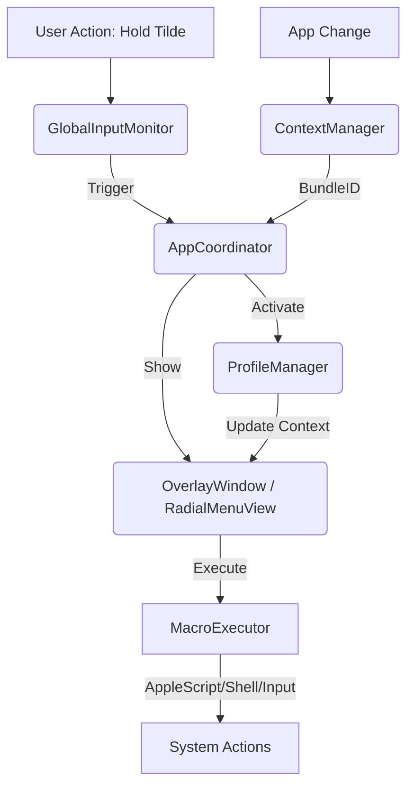

# DevDeck Architecture

This document provides a technical overview of the internal structure and design philosophy behind DevDeck.

## 🏛 Core Philosophy

DevDeck is designed to be **native, high-performance, and reactive**. It leverages Apple's modern frameworks (SwiftUI, Combine, AppKit) to provide a system-level experience that feels like a part of macOS.

## 🏗 System Components

The application is structured around several specialized "Managers" that handle different aspects of the system's state.

### 1. `AppCoordinator`
The orchestrator of the application. It acts as the central hub connecting the background input monitoring, context detection, and UI presentation.
- Manages the `OverlayWindow`.
- Routes macro execution commands.
- Handles global hotkey triggered state changes.

### 2. `GlobalInputMonitor`
A low-level event listener using `CGEventTap`. It monitors system-wide keyboard events to detect the "Tilde Hold" gesture.
- Runs on a dedicated run loop source.
- Uses a threshold (200ms) to distinguish between a short tap (re-injected as a tilde character) and a long press (summons the radial menu).

### 3. `ProfileManager`
The source of truth for all user profiles and macros.
- Handles CRUD operations for profiles.
- Manages active profile state.
- Implements Profile Import/Export logic via JSON serialization.

### 4. `ContextManager`
Observes the system for application focus changes using `NSWorkspace.shared.notificationCenter`.
- Detects the `bundleIdentifier` of the currently focused app.
- Feeds this information to the `ProfileManager` for automatic profile switching.

### 5. `SnippetManager`
Manages the library of code snippets.
- Handles pinning logic and language categorization.
- Provides search and filtering capabilities.

### 6. `PersistenceManager`
A simple, robust JSON-based persistence layer.
- Stores data in `~/Library/Application Support/DevDeck/`.
- Handles automatic migration and default profile loading.

## 🛸 UI Layer

### `RadialMenuView`
The core interface component. It uses circular geometry to layout macro nodes dynamically.
- **Glassmorphism**: Uses `.ultraThinMaterial` and custom gradients for a premium look.
- **Dynamic Physics**: Spring animations provide a responsive, physical feel.
- **Node Logic**: Dynamically calculates positions based on the number of macros in the current profile plus a system "Close" button.

## 🔄 Data Flow

## 🔐 Security & Permissions

DevDeck requires Accessibility permissions for two critical reasons:
1. **Input Monitoring**: To detect the tilde key globally even when the app is in the background.
2. **Keystroke Injection**: To simulate keyboard shortcuts on behalf of the user when executing macros.

No data ever leaves the machine; all profiles and snippets are stored locally in the application support directory.
